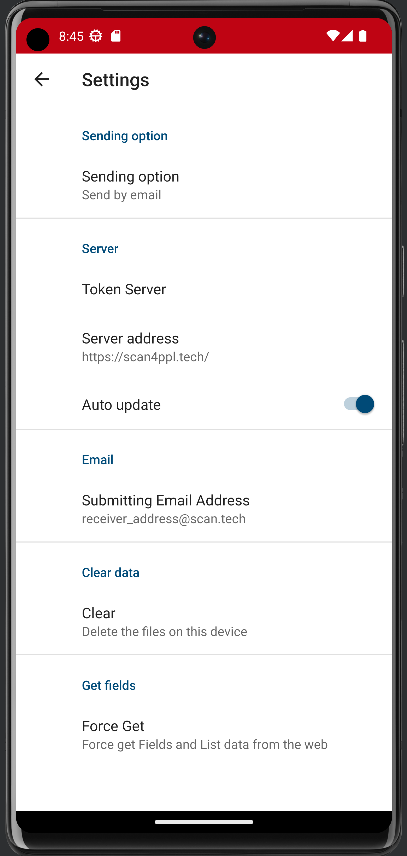

# 📊 Cytoscape

The graph of our network is created with the cytoscape library.&#x20;

It is accessible via the "Network graph" tab.

<figure><figcaption>
Network graph of our dummy situation
</figcaption></figure>

On this graph, you can see the people (identified according to their role if they have one), as well as the relations, with a color code specified in the chart.

You can also sort this graph by looking for a relations related to certain people.

Finally, it is possible to display the graph in several layouts according to your convenience, here are some exemples :&#x20;

<figure><figcaption>
Fcose Layout
</figcaption></figure>

<figure><figcaption>
Breadthfirst Layout
</figcaption></figure>

To do this, hold down the right mouse button and move the cursor to the desired layout :&#x20;

<figure><figcaption></figcaption></figure>

Finally, you can move the nodes with drag and drop.&#x20;


You will see on this graph only the persons registered in your team.

