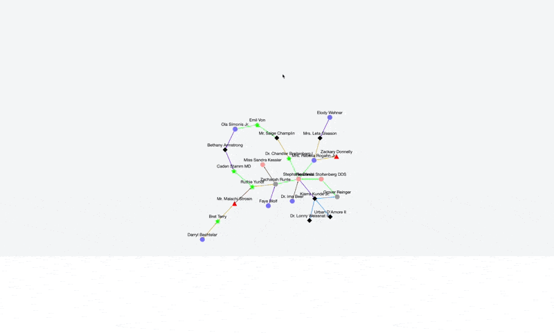
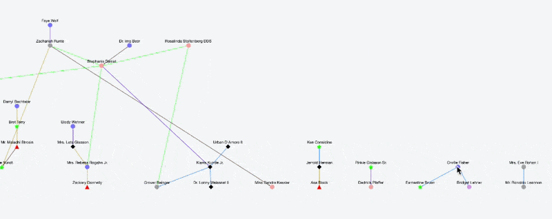
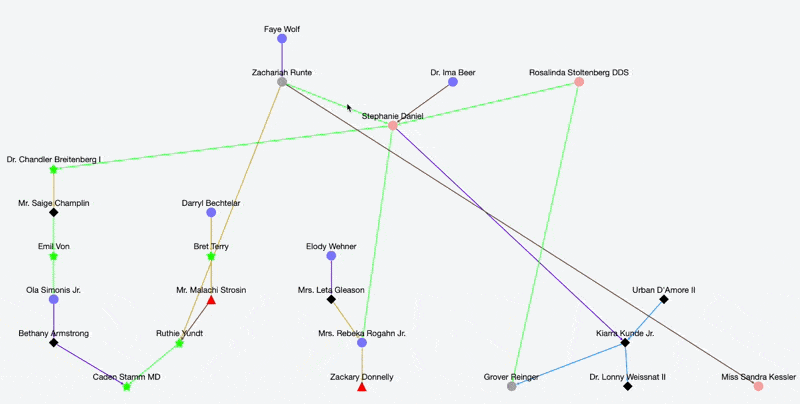

# 📊 Cytoscape

The graph of our network is created with the cytoscape library.

It is accessible via the "Network graph" tab. It is automatically created as soon as you have at least one relation in your team database.


You will see on this graph only the persons/relations registered in your team.


<figure><figcaption>
Network graph of our fake situation from the last section (for the rest of this documentation we will work with another situation)
</figcaption></figure>

On this graph, you can see the people (colored according to their role if they have one), as well as the relations, with a color code specified in the chart.


The colors are not dynamic at the moment, so if I add a new role in the list, it will not have a color automatically associated with it


## Filtering and Features

The library allows us to have a large number of filters and features on our graph to better navigate and inspect our elements.

Here is a non-exhaustive list of what you can do :

### **1. Filtering by hiding relations**

The person selection menu allows you to hide all direct and indirect relations that are not related to the selected person. This functionality is also accessible via the node wheel menu's Set as FROM/TO (see part 4.).

<figure><figcaption>
Hiding all relations not related to Orville Fisher
</figcaption></figure>

### 2. **Distance Calculus**

Through the person selection menu, if you select both a starting and an ending person, it will use the **Dijkstra** algorithm to calculate and display the shortest total link between the two people, among all available links. The chosen route is then shown in red :

<figure><figcaption>
Dijkstra calculation of the shortest path between Dr. Chandler and Mr. Malachi (according that all link have a weight of 1).
</figcaption></figure>

Morover, you can also calculate the **betweenness centrality** of a person with the corresponding button. The more central a person is in the overall architecture, the more its node will be colored towards red :

<figure><figcaption>
Here, Stephanie Daniel is the most "central" person considering all relations. The goes Zachariah and Ruthie.
</figcaption></figure>

### 3. **General features**

We have a contextual "wheel" menu that can be accessed by holding down the right mouse button and dragging the mouse to the chosen option :

<figure><figcaption>
Contextual wheel
</figcaption></figure>

This wheel has several options that you can select :

* Degre, Cise, Fcose and Breathfirst layout : these are automatic layouts that allow you to place all the nodes according to a precise organization. This is what they look like :

<figure><figcaption>
Dagre Layout
</figcaption></figure>

<figure><figcaption>
Cise Layout
</figcaption></figure>

<figure><figcaption>
Fcose Layout
</figcaption></figure>

<figure><figcaption>
Breadthfirst Layout
</figcaption></figure>

* Show and Hide realtions details : These options allow you to show or hide the details of all the relations. This information is optional when creating the relation.

Here is an example of the different features of this wheel :&#x20;

<figure><figcaption>
Change layout with the wheel
</figcaption></figure>

### 4. Node features

You can also move the nodes with drag and drop and right click on them to display another wheel menu. The menu is specific to the node on which the menu was called.

<figure><figcaption>
Node specific wheel menu
</figcaption></figure>

This node wheel has several options that you can select :

* Set as FROM/TO : This function is equivalent to sorting the relations at the departure or arrival of this person (in the same way as in part 1.)
* View information : This redirects to the details (show) page of the selected person
* View related persons : This makes it possible to hide all persons who do not have a direct or indirect relationship with the selected person
* Save position : This allows you to save the position of a particular node for the user's profile <mark style="color:yellow;">(NOT CURRENTLY FUNCTIONING)</mark>

Here is an example of the different features of this wheel :&#x20;

<figure><figcaption>
View related persons, thanks to the node context wheel
</figcaption></figure>

### 5. Relation features

Finally, we also have the wheel menu for relations, you can access it with the same principle of right click on a relation. The menu is specific to the relation on which the menu was called.

<figure><figcaption>
relation specific wheel menu
</figcaption></figure>

This node wheel has several options that you can select :

* Show/Hide detail : This option allows you to show or hide the details of the relation
* Edit relation : this redirects to the page allowing to modify the relation.

Here is an example of the different features of this wheel :&#x20;

<figure><figcaption>
Hide and show relation details with the relation wheel
</figcaption></figure>
