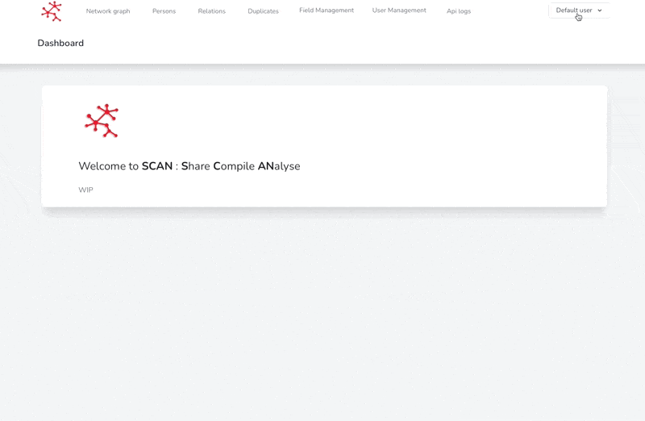

# Change my team

If your role allows it, you can change your team.


If you do not see the 'Change team' section, it is because your role does not allow you to do so.


1. Go to your profile
2. Search for the 'Change Team' section and choose the team you want to move to


By changing your team, you will no longer see the dataset of the team you belonged to before. You can always reassign to your old team so that you regains access to the old data


<figure><figcaption>
Change team
</figcaption></figure>
