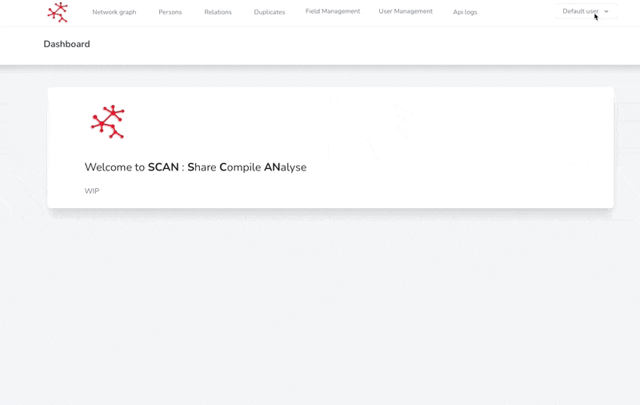

# 🙋♂ My profile

You can access your profile by clicking on your name at the top right corner.

<figure><figcaption>
Go to my profile
</figcaption></figure>

Depending on your permissions, this section allows you to :


[get-my-api-token.md](get-my-api-token.md)



[enable-or-disable-2fa.md](enable-or-disable-2fa.md)



[request-a-new-role.md](request-a-new-role.md)



[change-my-team.md](change-my-team.md)

