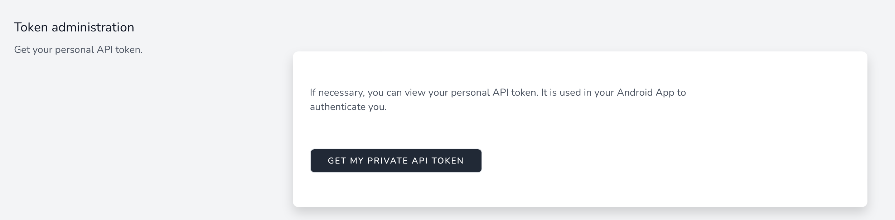

# Get my API token

The api token is a unique and personal character string. It allows you to link your SCAN account to the mobile application.


It is **personal** to you and **must not be transmitted** in any case.


To retrieve your API token :

1. go to your profile (click on your name at the top right, then profile)
2. In the Token administration section, click on get my private API Token
3. Enter your password
4. Your API Token is displayed. You can consult it at any time

<figure><figcaption>
Get your private API Token
</figcaption></figure>
