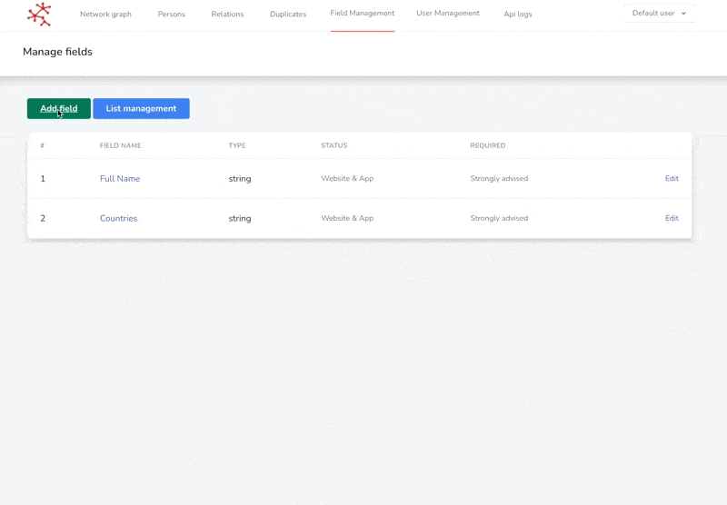

# 🗃 Fields

## Create a new field

SCAN allows you to create new fields in your team. To do so:

1. Go to Field Management > Fields
2. Add field
3. Fill in the form and click on Add

**Here are the details of the form:**


The <mark style="color:orange;">orange</mark> **and **<mark style="color:red;">**red**</mark>** fields are particularly important and often a source of error. Pay special attention to them.**


| Field                                                                | Description                                                                                                                                                                                                                                                                                                                                                                                            |
| -------------------------------------------------------------------- | ------------------------------------------------------------------------------------------------------------------------------------------------------------------------------------------------------------------------------------------------------------------------------------------------------------------------------------------------------------------------------------------------------ |
| Field's title                                                        | The title of the field that will be displayed                                                                                                                                                                                                                                                                                                                                                          |
| Field's placeholder                                                  | The placeholder is an indication to inform the user on the right way to fill the field                                                                                                                                                                                                                                                                                                                 |
| Field's Data type                                                    | Allows you to define the type of field (short text, long text, number, date, check box)                                                                                                                                                                                                                                                                                                                |
| Field's requirement state                                            | Allows you to qualify the importance of this field. The more the field is required, the more it will be highlighted in the form.                                                                                                                                                                                                                                                                       |
| <mark style="color:orange;">Field's activation status</mark>         | 
Allows you to define whether the field is activated or not. Three options are available: Disabled, Website, Website &#x26; App.  <strong>Disabled</strong>: Disables the form field 

 <strong>Website</strong>: the field is only available on the website   <strong>Website and App</strong>: the field is available on the website and on the mobile application  
 |
| Field's order                                                        | The order of the field in the form                                                                                                                                                                                                                                                                                                                                                                     |
| <mark style="color:orange;">Is that a descriptive value ?</mark>     | Allows you to define the field as an important value. The field will then be displayed in the Person summary table. There can be more descriptive value in a form.                                                                                                                                                                                                                                     |
| <mark style="color:red;">Is that the best descriptive value ?</mark> | 
A best descriptive value is the most important field. It is thanks to this field that the person is identified. 

It <strong>can only have one best descriptive value per form.</strong> 

Often we define the full name as the best descriptive value.
                                                                                                                               |
| Field's associated list                                              | Here you can associate a list with your field. In case you associate a list, the user will have to choose a defined item from this list.                                                                                                                                                                                                                                                               |

The example below shows the creation of a number field, which will be displayed on the site and the application. This field is not a descriptive value.

<figure><figcaption>
Create a new integer field
</figcaption></figure>

