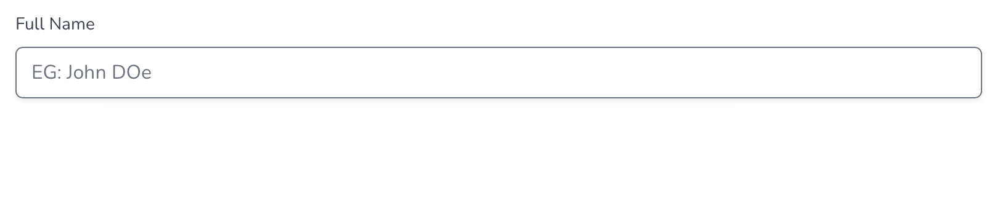
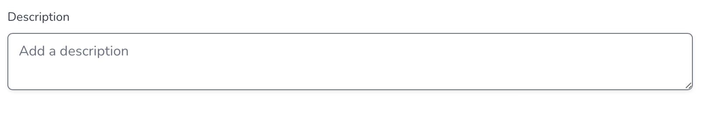
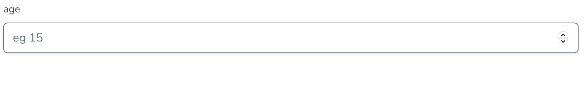
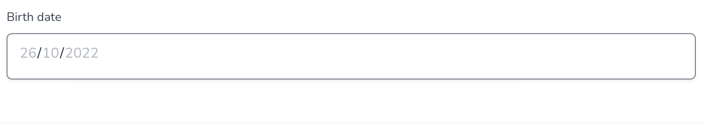
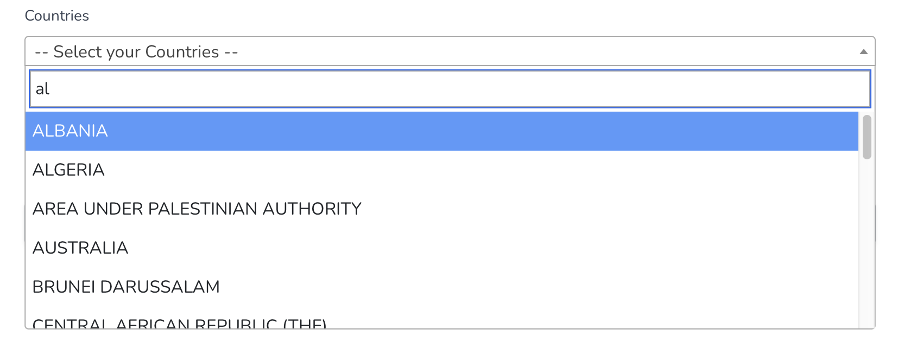

# Fields type

This page seeks to detail all the types of fields you can choose when creating a field.

## Small Text

A small text field gives the possibility to fill in a short text.

<figure><figcaption>
Short text input
</figcaption></figure>

## Long Text

A long text field gives the possibility to fill in a long text.

<figure><figcaption>
Long text input
</figcaption></figure>

## Integer

An integer field gives the possibility to fill in a number.

<figure><figcaption>
Integer input
</figcaption></figure>

## Date

A date field gives the possibility to fill in a date.

<figure><figcaption>
Date input
</figcaption></figure>

## Yes / No (wip)

[https://github.com/TC-netw4ppl/website/issues/293](https://github.com/TC-netw4ppl/website/issues/293)

## List

A list field gives the possibility to pick up an element from a given list. SCAN allows you to [create your own lists](../lists.md). Just take a look at the next section !

<figure><figcaption>
List input
</figcaption></figure>
