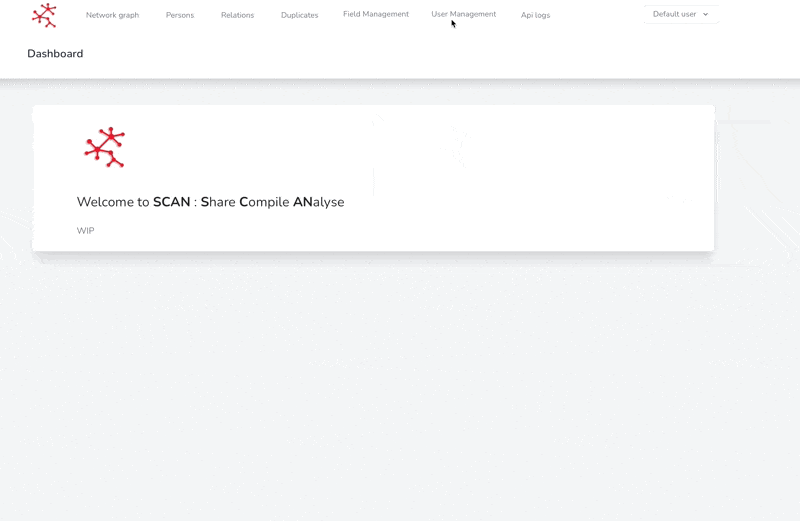
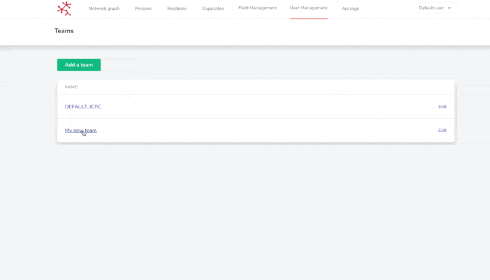

# 🧑 Teams

A team allows to gather different users around the same data set. Each team is independent from each other which allows SCAN to have different forms and to collect data in multiple contexts.

### Creating a new team

To create a new team :

1. Click on Teams (User Management section)
2. Click on Add a team
3. Fill the name and create
4. You're done !

<figure><figcaption>
How to create a team in 10 seconds ?
</figcaption></figure>

### Add user to a team

Once your team is created, you can add user to this team.

A user only sees the information of the team he is in. In other words, by changing the team of a user, he will no longer see the dataset of the team he belonged to before. You can always reassign the user to his old team so that he regains access to the old data. Note that some users with the user.changeTeam permission can change their team themselves by following this procedure: [change-my-team.md](../basic-usage/my-profile/change-my-team.md "mention").


You must have the required permissions to perform this operation



**Warning :** This will remove the user from his current team


You just have to :&#x20;

1. Click on the name of the team you want to add the user to
2. In the 'User in team section', select the user you want to add to the team and add him

<figure><figcaption>
Add a user to a team
</figcaption></figure>

### Remove a user from a team

A user **must necessarily belong to a team**. It is therefore not possible to remove him from a team. If you don't want a user to have access to your team anymore, you have to put him in another team. To do this, simply [follow the procedure described above.](inviting-members.md#add-user-to-a-team)

### Update or Delete a team

To update or delete a team, you should :

1. Click on the name of the team you want to edit/delete
2. Clic on edit or delete


When you delete a team, all its users are automatically assigned to the default team.

