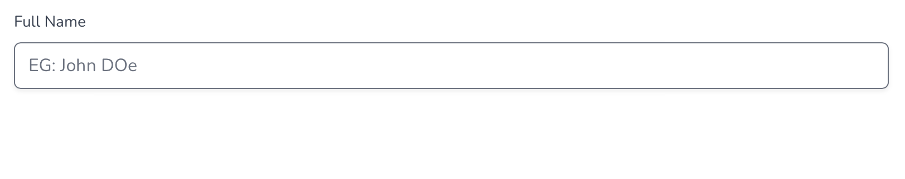
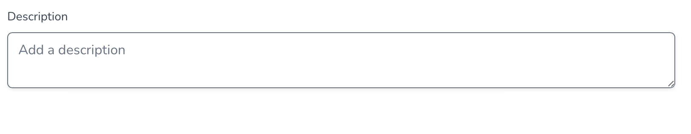
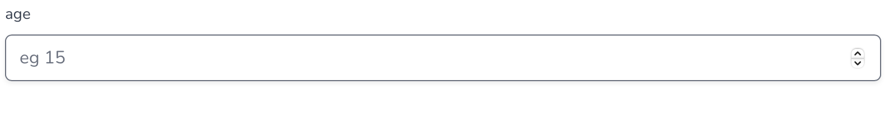
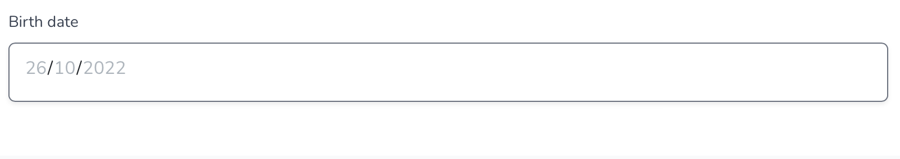

# Fields type

This page seeks to detail all the types of fields you can choose when creating a field (if you are not interested, you can go to [lists.md](../lists.md "mention")).

## Small Text

A small text field gives the possibility to fill in a short text.

<figure><figcaption>
Short text input
</figcaption></figure>

## Long Text

A long text field gives the possibility to fill in a long text.

<figure><figcaption>
Long text input
</figcaption></figure>

## Number

An number field gives the possibility to fill in a number. This datatype is rangeable.

<figure><figcaption>
Integer input
</figcaption></figure>

## Date

A date field gives the possibility to fill in a date. This datatype is rangeable.

<figure><figcaption>
Date input
</figcaption></figure>

## Yes / No

A Yes/No field allow you to add a checkbox. If the box is checked, the information is true.

<figure><figcaption>
Yes / No input
</figcaption></figure>

## List

A list field gives the possibility to pick up an element from a given list. SCAN allows you to [create your own lists](../lists.md). Just take a look at the next section !

<figure><figcaption>
List input
</figcaption></figure>

## Color

A color field gives the possibility to fill in a color. It can be usefull to associate a color to your data to visualize it !

<figure><figcaption>
Color input
</figcaption></figure>

## Coordinate

This field allow you to fill in a latitude and a longitude. These data can be visualized onto a map (WIP).

<figure><figcaption>
Coordinate input
</figcaption></figure>

## Range

This field type displays a slide bar to select a ranged number (between 0 and 100 basically).

<figure><figcaption>
Range input
</figcaption></figure>
