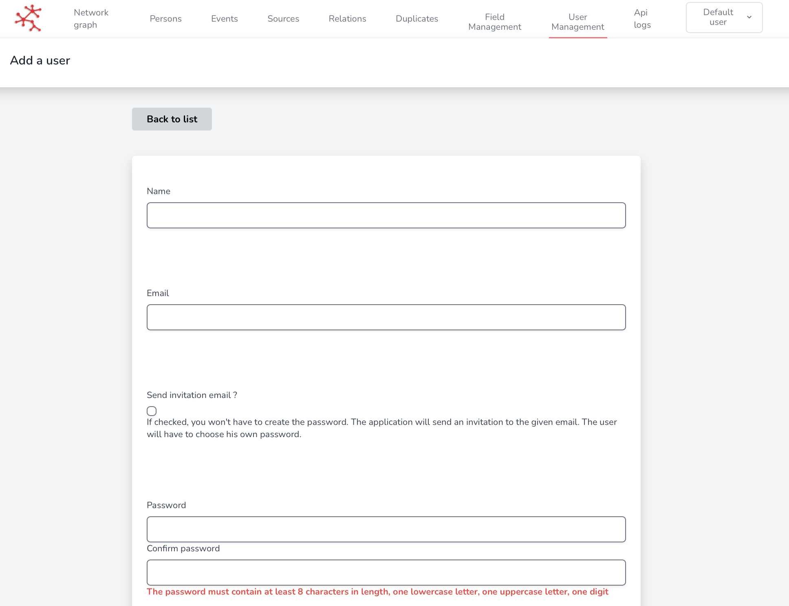

# 👩💻 Users

In this section you will learn how to create new users.

## Creating a new User 

You can go to the _Users_ section in _User management_. You will see the index of the different existing users.

<figure><figcaption>
User index
</figcaption></figure>

By clicking on _Add user_, you will arrive on this page of User creation :

<figure><figcaption>
User creation
</figcaption></figure>

You will then have several fields to fill in:

* The **Name** of the user,
* his **Logins** (email and password)


Please note that by clicking on _Send invitation email ?_ you won't have to fill the password, SCAN will send an email asking the person to create a passsord.


* his **Role** (among those by default or a created one)


The role defines the permissions associated with the user (See [roles](roles/ "mention"))


* and finally his **Team** (by default DEFAULT\_ICRC).


The team refers to the unique form that users will complete to create a persona (See [inviting-members.md](inviting-members.md "mention"))


You then register your user by clicking on the Create button at the end of the page, and you can then send the logins to your colleague.

Like any field in our application, you can edit your user at any time (to change the role for example), but also delete him.

## Re-invite a user

If one of the user has forget his password, you can resend an invitation link by cliking on **Re-invite** on the user's details page.

## Grant or Reject Role

If a user has permission (user.requestRole), he can request a role from his administrator (you).

You can then grant or reject it, from the **user index page** in the dedicated section :

<figure><figcaption>
Here, the user "My user" has requested the editor role, you can grant him or reject him the role.
</figcaption></figure>

## Manage API token permissions

In the **detail page of a user**, you can also manage the permissions of its API token, to control if your user can use the API to create, delete, read or update data :

<figure><figcaption>
Manage API tokens section
</figcaption></figure>

By clicking on the button highlighted in yellow in the image above, a contextual menu appears to allow you to modify these permissions.

<figure><figcaption>
Contextual menu to select permissions
</figcaption></figure>
