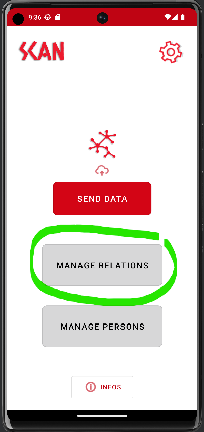

# 📬 Server-less

First, go to the settings:

.png>)->

To do this, you must first synchronize your application with your scan server, then switch to a serverless usage and publish the data by email.

#### Step 1

You will have to be sure to set all the following options:

* Sending Option : Send to server
* Token server : Enter your personal API token (ask your administrator if you are not sure)
* Server address : your SCAN deployment url (with "https://")

Now you can click on Force Get to synchronize the application with the form created beforehand by your team administrator.

#### Step 2

From this moment, you can choose the Send By Mail option in Sending Option, enter the chosen Submitting Email Address.

\=> With this configuration, each time you synchronize the data, they will be sent by email in .json format to the chosen submiting email address
